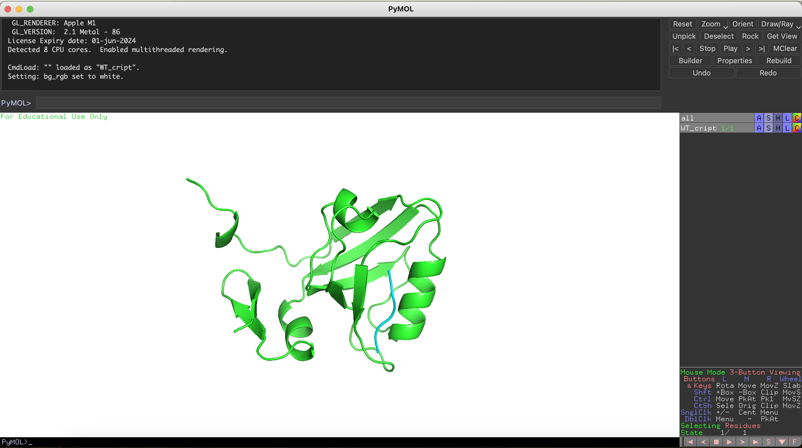
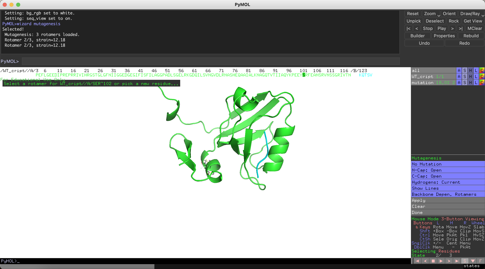
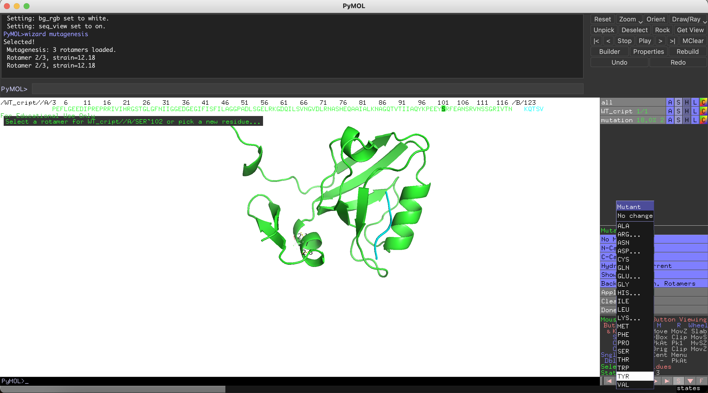
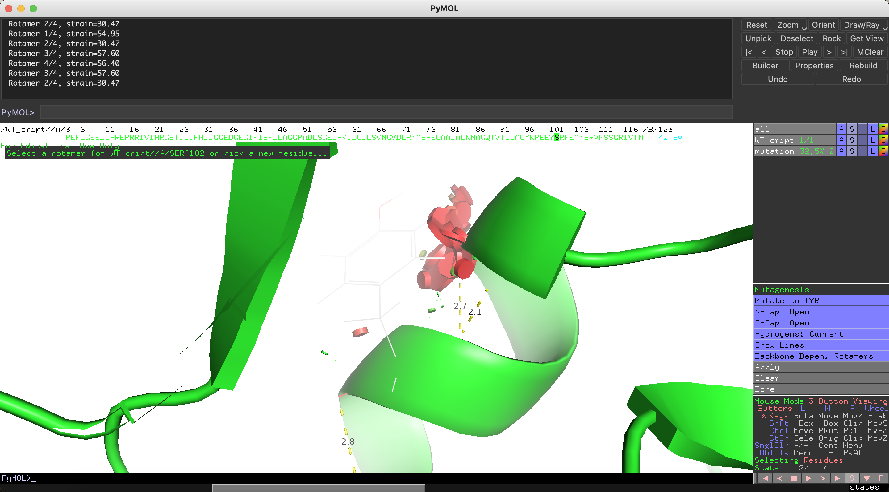
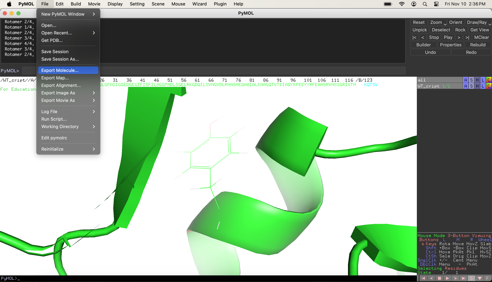
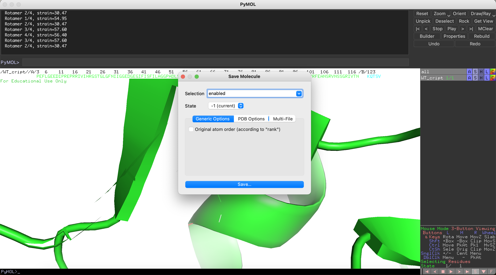
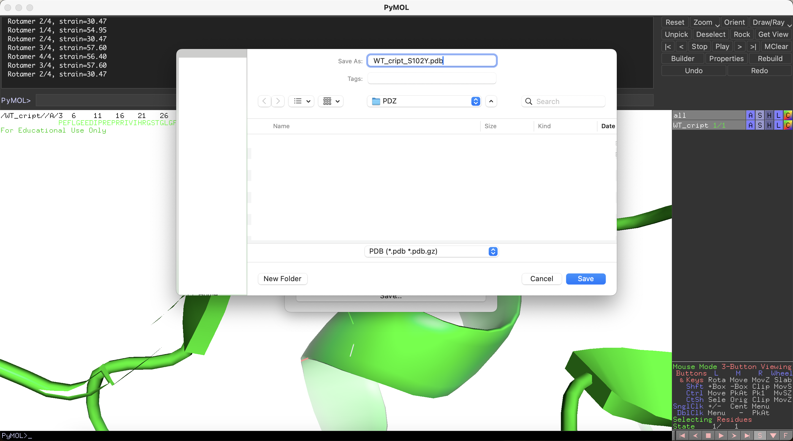

# Guide for Steered Molecular dynamics (SMD) simulation on ASU Sol cluster

## Make a mutation with PyMOL

Download `WT_cript.pdb` from PDZ folder on github

Start PyMOL and load `WT_cript.pdb` 



From Display show the `Sequence`

From `Wizard` go to `Mutagenesis` and select `Protein`


As an example we are going to make the `S102Y` mutation

From the `Sequence` click on `S102`. This will select residue `S102` and show options on the right panel



On the right panel click `No Mutation` and from the new panel select `TYR`



Using the arrows at the bottom of the right panel select a side chain rotamer with least amount of clashes (shown as red regions on the protein). After selecting the rotamer, first click `Apply` then click `Done`



Go to `File` and select `Export Molecule`



click `Save`



Type the name of the new pdb file as `WT_cript_S102Y` (without pdb extension) and then select `PDB` from the menu below and click `Save`



Now we created `WT_cript_S102Y.pdb`

## Using VPN to connect to ASU network:

Run `Cisco Secure Client` VPN software

type `sslvpn.asu.adu`


Click `Connect`

when asked for username/pass use:

```
username: asuid
pass: asupass
second pass: push 
```

## Login to sol

on your terminal window:

sol:

```
ssh ikazan@login.sol.rc.asu.edu
```

(change asuid to yours)

## After logging in:

`pwd` shows me home directory `/home/ikazan`

change directory to scratch space

```
cd /scratch/ikazan
```

create a new directory here by using

```
mkdir -pv testdir1
```

change directory to the new one

```
cd testdir1/
```

```
ls
```

the directory is empty

`pwd` shows me the current working directory

copy the SMD directory on github to the `/scratch/ikazan/testdir1` directory on sol. Run the command on the terminal connected to your local computer.

```
scp -r SMD ikazan@login.sol.rc.asu.edu:/scratch/ikazan/testdir1/
```

## prepare SMD

Swtich terminal window to the one connected to sol and run

```
cd SMD
```

```
cd prepare
```

```
sbatch pull_prepare.sh [62] [123 125 127] 3 0.0001 25
```

(`sbatch pull_prepare.sh <FIX> <SMD> <k> <Vel> <dis> `)

we will copy the prepared files to `required_files` directory

```
cp -v WT_cript_S102Y.parm ../required_files/
cp -v last_prod.pdb ../required_files/
cp -v WT_cript_S102Y_rest.pdb ../required_files/
cp -v WT_cript_S102Y_SMD.ref ../required_files/
```

then

```
cd ..
```

## run SMD

run 50 pulls

```
circle_run.sh 1 50
```
